<!-- Banner -->

  

  

---

### 👨🏻‍💻 About Me

- 🌐 **Network technician** by trade, moving into systems engineering
- 🏠 **Homelab** enthusiast: UniFi · Proxmox · Home Assistant
- 🚗 **Automotive**: VAG coding · tuning · ECU mapping
- ⚙️ **Scripting & automation**: Python · C++ · AHK · AutoIt
- 🤝 Open to opportunities in **networking & systems**

---

### 🛠️ Tech Stack

**🌐 Networking & Infrastructure**

  
  
  
  
  
  

**⚙️ Programming & Scripting**

  
  
  
  
  
  
  

**🚗 Automotive**

  
  
  
  
  

---

### 📌 Featured Projects

| | Project | What it is |
|:-:|---|---|
| 🚗 | **VCDS&#8209;Leon5F**&nbsp;🔒 | Custom coding toolkit for my Seat Leon Cupra 300 hp: unlocking hidden features, tweaking comfort and lighting settings, with every change scripted, tested and documented step by step. |
| 🏠 | **Homelab**&nbsp;🔒 | My home network and smart-home setup, designed like a real company infrastructure: segmented network, virtualization, local home automation and full documentation to rebuild it anytime. |
| 🎮 | **[CS2-Config](https://github.com/byjerkz/CS2-Config)** | A ready-to-use Counter-Strike 2 config for competitive and FACEIT play: tuned for minimal input lag, clean visuals and consistent aim, audited from real game files and fully reproducible. |

🔒 Private repositories. Curious about one of them? Feel free to reach out.

---

### 📊 GitHub Stats

  

  

